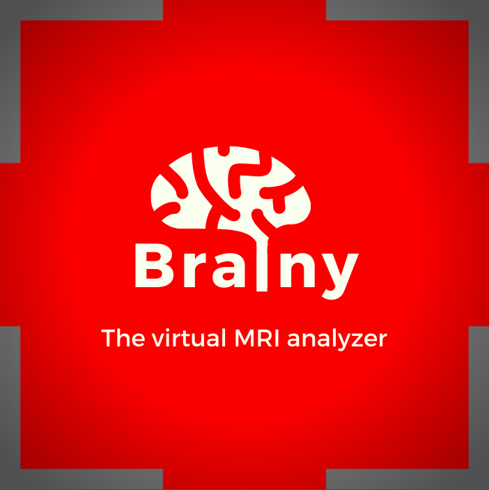
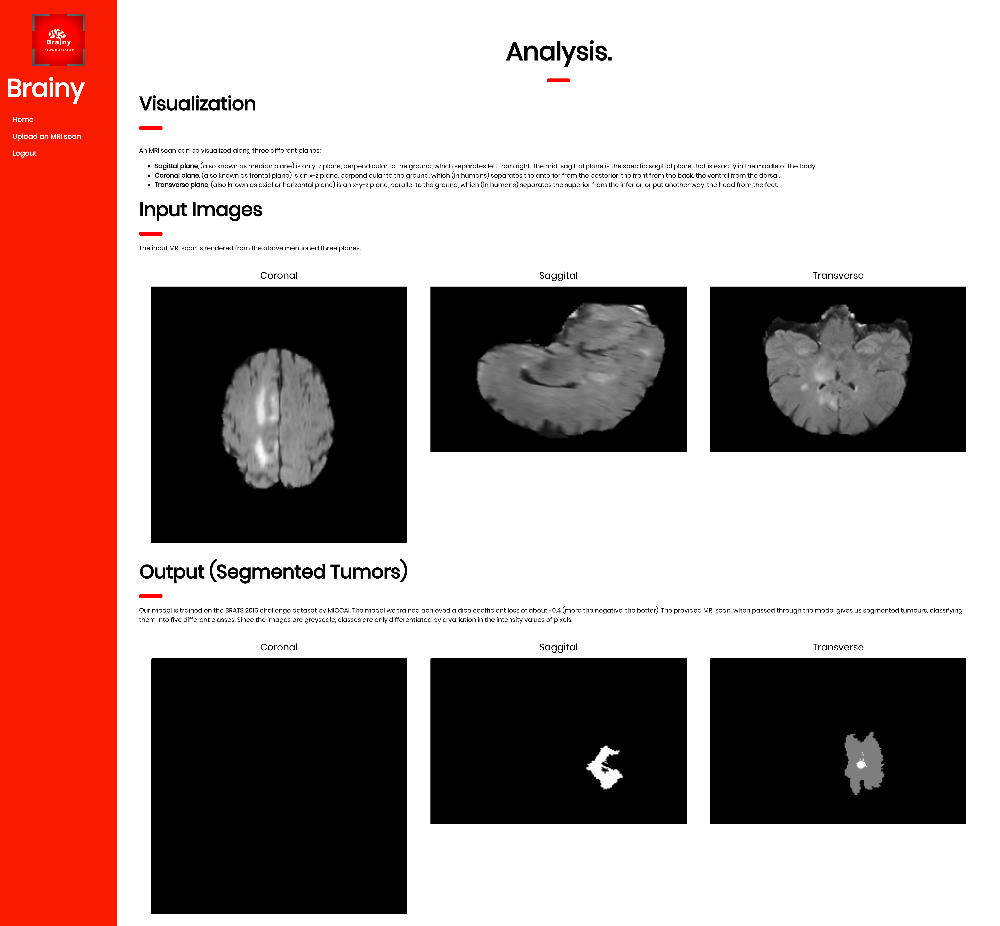
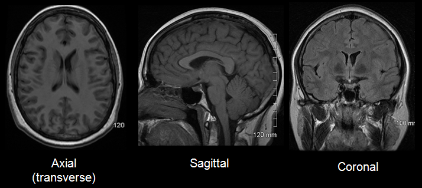
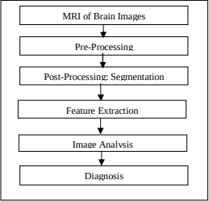
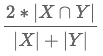
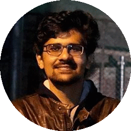

    

    	
    

    

Brainy

<blockquote>The virtual MRI Analyzer</blockquote>

<b>A screenshot of the project interface</b>

# Project Overview

    

    
    

    

        MRI is a very popular technique to detect tumours. MRI creates cross-section pictures of your insides. But MRI uses strong magnets to make the images – not radiation. An MRI scan takes cross-sectional slices (views) from many angles, as if someone were looking at a slice of your body from the front, from the side, or from above your head. 
MRI creates pictures of soft tissue parts of the body that are sometimes hard to see using other imaging tests.MRI is very good at finding and pinpointing some cancers. An MRI with contrast dye is the best way to see brain and spinal cord tumors.
    

## **Why this Project** 

> With a surge in the brain related ailments in the world, every year over 2,500 of the Indian children suffer from medulloblastoma, a pediatric malignant primary brain tumour which spreads through the cerebrospinal fluid (CSF) and frequently metastasize to different locations along the surface of the brain and spinal cord, doctors have said.
>
> According to them, in India, every year 40,000-50,000 persons are diagnosed with brain tumour. Of these 20 per cent are children. Until a year ago, the figure was only somewhere around 5 per cent.
>
> The doctors said that if the cases are detected early, then 90 per cent of the tumour cases are curable, provided the treatment protocol is followed correctly.

<blockquote><i>-Source (“The Hindu “)</i></blockquote>

- Though the technology used in MRI seems to be quite technically advanced, for the detection of tumour in the MRI image, currently we mostly rely on human skill and expertise. 

- Although this method proves to be accurate in most of the cases, it sometimes fails when the human eye fails to detect tiny irregularities 
- In a country like India, there is a lack of skilled Oncologists and Neurologists present.

- According to a report in 2018 , the country is facing a severe shortage of care-givers with merely 2000 Oncologists to look after around 10 Million patients. 

- The condition is much more worse in the rural areas where the count of Oncologists is much less.

## **Proposed Solution**

> *Jump directly to the training notebook by clicking **[here](training.ipynb)***

​	In order to solve this problem, we propose Brainy, our Brain MRI segmentation tool. Not only would Brainy automatise the entire process of diagnosis for tumours , but it would also help in solving out those cases which are generally missed by the human eye. 

#### **About the Dataset**

​	The data that we’ve used is the BRATS dataset. This dataset contains the segmented images of the brain tissues. After the image has been segmented, there are 5 classes namely Necrosis, Edema , Non-Enhancing tumour , Enhancing  tumour and the background. There are about 220 images in the training dataset.

#### **The Model**

    

         
<b>The Model Pipeline</b>

	

        

            To segment the brain MRI’s we use a popular network called <b>U-Net</b>.
The U-Net architecture is built upon the Fully Convolutional Network and modified in a way that it yields better segmentation in medical imaging. Compared to FCN-8, the two main differences are:   
            <b>1.</b> U-net is symmetric and  
            <b>2.</b> The skip connections between the downsampling path and the upsampling path apply a concatenation operator instead of a sum.   
These skip connections intend to provide local information to the global information while upsampling. Because of its symmetry, the network has a large number of feature maps in the upsampling path, which allows to transfer information. By comparison, the basic FCN architecture only had number of classes feature maps in its upsampling path. 
        

    

         
<b>The U-Net Model</b>

	

    

        	   </b>The U-Net owes its name to its symmetric shape, which is different from other FCN variants. U-Net architecture is separated in 3 parts:  
            <b>1.</b> The contracting/downsampling path  
            <b>2.</b> Bottleneck  
        	<b>3.</b> The expanding/upsampling path   
	

#### Metrics

    

         
<b>Dice Loss Equation</b>

	

    

        To quantify the performance of our image segmentation, <b>Dice Score</b> is used. The algorithm is validated by calculating the Dice score, which is a measure of how similar the objects are. So it is the size of the overlap of the two segmentations divided by the total size of the two objects. That is, the score for a particular class c is the size of the overlap between the predicted region and its true counterpart. We were able to achieve best coefficient of dice loss score <b>0.43</b> (higher the better).
    

 

# Team

|  |  |  |
| :----------------------------------------------------------: | :----------------------------------------------------------: | :----------------------------------------------------------: |
|            [Gk Tejus](http://github.com/gktejus)             | [Suyog Jadhav](<a href="http://github.com/IAmSuyogJadhav" target="_blank">) | [Udbhav Bamba](<a href="http://github.com/ubamba98" target="_blank">) |

---

# References

- Brain Tumor Segmentation with Deep Neural Networks (<https://arxiv.org/pdf/1505.03540.pdf>)
- Generalised Dice overlap as a deep learning loss function for highly unbalanced segmentations (<https://arxiv.org/abs/1707.03237>)
- U-Net: Convolutional Networks for Biomedical Image Segmentation (<https://arxiv.org/pdf/1505.04597.pdf>)
- An Open Source Implementation of 3D-Unet (<https://github.com/96imranahmed/3D-Unet>)
- BRATS 2015 Dataset (<https://www.med.upenn.edu/>)

---

